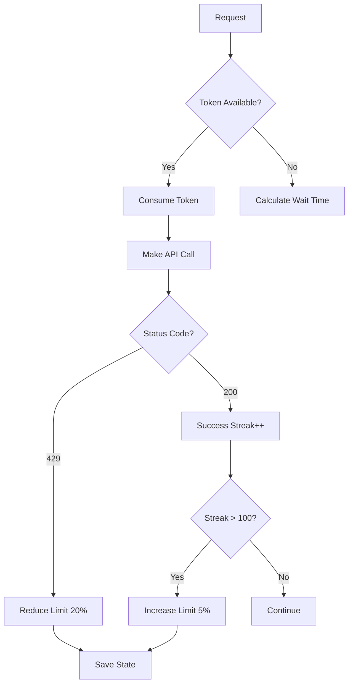

# Adaptive Rate Limiter

## 📋 Índice

- [Descripción](#descripción)
- [Características](#características)
- [Instalación](#instalación)
- [Uso Rápido](#uso-rápido)
- [Arquitectura](#arquitectura)
- [API Reference](#api-reference)
- [Ejemplos Avanzados](#ejemplos-avanzados)
- [Best Practices](#best-practices)
- [FAQ](#faq)

---

## Descripción

Sistema de **rate limiting inteligente y adaptativo** que aprende automáticamente los límites de las APIs y optimiza el uso de recursos. Implementa el algoritmo **Token Bucket** con capacidades de auto-ajuste basadas en respuestas reales de las APIs.

### ¿Por qué es necesario?

- **Evita bloqueos**: Previene errores 429 (Too Many Requests)
- **Maximiza throughput**: Utiliza el máximo de requests permitidos sin exceder límites
- **Aprende automáticamente**: Se adapta a límites desconocidos o cambiantes
- **Multi-API**: Gestiona múltiples APIs con diferentes límites simultáneamente
- **Priorización**: Requests críticos tienen preferencia sobre analytics

---

## Características

### ✨ Core Features

| Feature | Descripción |
|---------|-------------|
| 🧠 **Auto-learning** | Aprende límites de respuestas 429 |
| 🪣 **Token Bucket** | Algoritmo eficiente con burst support |
| 📊 **Per-Endpoint** | Límites específicos por endpoint |
| 🎯 **Priority Queue** | 4 niveles de prioridad (CRITICAL, HIGH, MEDIUM, LOW) |
| 📈 **Adaptive** | Auto-ajuste basado en success rate |
| 💾 **State Persistence** | Guarda estado para reinicio sin pérdida |
| 🔍 **Monitoring** | Métricas detalladas en tiempo real |
| 🔒 **Thread-safe** | Soporta concurrencia sin race conditions |

### 📊 Métricas Disponibles

- Total requests (allowed/blocked)
- Rate limit hits (429 responses)
- Average wait time
- Success streak
- Response time statistics
- Current token availability
- Block rate percentage

---

## Instalación

No requiere dependencias adicionales, usa solo stdlib de Python:

```python
from core.adaptive_rate_limiter import (
    AdaptiveRateLimiter,
    RateLimitConfig,
    Priority
)
```

---

## Uso Rápido

### Ejemplo Básico (30 segundos)

```python
from core.adaptive_rate_limiter import AdaptiveRateLimiter, POLYMARKET_CONFIG

# 1. Crear limiter
limiter = AdaptiveRateLimiter()

# 2. Registrar API
limiter.register_api(POLYMARKET_CONFIG)

# 3. Hacer request
success, wait_time = limiter.acquire('polymarket')

if success:
    # Hacer tu API call
    response = api.get('/markets')
    
    # Reportar resultado para adaptive learning
    limiter.record_response('polymarket', response.status_code, response.elapsed)
else:
    print(f"Rate limited. Wait {wait_time:.2f}s")
```

### Integración con Cliente Existente

```python
import requests
from core.adaptive_rate_limiter import AdaptiveRateLimiter, Priority

class PolymarketClient:
    def __init__(self):
        self.limiter = AdaptiveRateLimiter()
        self.limiter.register_api(POLYMARKET_CONFIG)
        self.session = requests.Session()
    
    def get_markets(self):
        # Wait for rate limit
        if not self.limiter.wait_if_needed('polymarket', 
                                           endpoint='/markets',
                                           priority=Priority.HIGH):
            raise Exception("Rate limit timeout")
        
        # Make request
        start = time.time()
        response = self.session.get('https://api.polymarket.com/markets')
        response_time = time.time() - start
        
        # Record for learning
        self.limiter.record_response('polymarket', 
                                     response.status_code, 
                                     response_time,
                                     '/markets')
        
        return response.json()
```

---

## Arquitectura

### Token Bucket Algorithm

```
┌─────────────────────────────────┐
│     TOKEN BUCKET                │
│                                 │
│  Capacity: 100 tokens           │
│  Current:   45 tokens           │
│  Refill:    1.67 tokens/sec     │
│                                 │
│  ┌─────────────────────┐        │
│  │ ████████████░░░░░░░ │ 60%    │
│  └─────────────────────┘        │
│                                 │
│  consume(5) → ✅ SUCCESS        │
│  consume(50) → ⏸️ WAIT 3.2s    │
└─────────────────────────────────┘
```

### Flujo Adaptativo



### Niveles de Prioridad

```python
Priority.CRITICAL = 1  # Trading execution, health checks
Priority.HIGH = 2      # Price updates, orderbook
Priority.MEDIUM = 3    # Market data, positions (default)
Priority.LOW = 4       # Historical data, analytics
```

**Comportamiento:**
- CRITICAL/HIGH: Wait time mínimo (max 1s sleep)
- MEDIUM/LOW: Wait time completo según token bucket

---

## API Reference

### RateLimitConfig

```python
config = RateLimitConfig(
    name='api_name',           # Identificador único
    max_requests=100,          # Max requests por ventana
    window_seconds=60,         # Ventana de tiempo
    burst_size=10,             # Capacidad de burst
    adaptive=True,             # Habilitar auto-ajuste
    min_requests=10,           # Límite mínimo de seguridad
    max_requests_cap=1000,     # Límite máximo posible
    backoff_multiplier=0.8,    # Factor reducción en 429 (20%)
    recovery_multiplier=1.05   # Factor incremento en éxito (5%)
)
```

### AdaptiveRateLimiter

#### Constructor

```python
limiter = AdaptiveRateLimiter(
    save_state=True  # Persistir estado en data/rate_limiter_state.json
)
```

#### Métodos Principales

##### register_api(config: RateLimitConfig)

Registra una nueva API con configuración de límites.

```python
limiter.register_api(POLYMARKET_CONFIG)
```

##### acquire(api_name, endpoint='default', priority=Priority.MEDIUM, tokens=1)

Intenta adquirir permisos para hacer request.

**Returns:** `(success: bool, wait_time: float)`

```python
success, wait = limiter.acquire('polymarket', '/markets', Priority.HIGH)
if success:
    # Make request
else:
    time.sleep(wait)
```

##### wait_if_needed(api_name, endpoint='default', priority=Priority.MEDIUM, tokens=1, timeout=60.0)

Espera automáticamente hasta que haya tokens disponibles.

**Returns:** `bool` (True si adquirió, False si timeout)

```python
if limiter.wait_if_needed('polymarket', timeout=30.0):
    response = api.get('/markets')
```

##### record_response(api_name, status_code, response_time, endpoint='default')

Registra respuesta de API para adaptive learning.

```python
limiter.record_response('polymarket', 200, 0.145, '/markets')
limiter.record_response('polymarket', 429, 0.500, '/orderbook')  # Auto-reduce limit
```

##### set_endpoint_limit(api_name, endpoint, max_requests, window_seconds=60)

Establece límite específico para un endpoint.

```python
# Endpoint pesado: solo 5 req/min
limiter.set_endpoint_limit('polymarket', '/heavy_analytics', 5, 60)
```

##### get_stats(api_name=None)

Obtiene estadísticas de uso.

```python
stats = limiter.get_stats('polymarket')
print(f"Allowed: {stats['allowed']}, Blocked: {stats['blocked']}")

# Todas las APIs
all_stats = limiter.get_stats()
```

##### print_stats(api_name=None)

Imprime estadísticas formateadas.

```python
limiter.print_stats('polymarket')
limiter.print_stats()  # Todas las APIs
```

##### reset_api(api_name)

Reiniciar API a configuración inicial.

```python
limiter.reset_api('polymarket')
```

---

## Ejemplos Avanzados

### 1. Multi-API con Prioridades

```python
limiter = AdaptiveRateLimiter()

# Registrar múltiples APIs
limiter.register_api(POLYMARKET_CONFIG)
limiter.register_api(BINANCE_CONFIG)
limiter.register_api(COINGECKO_CONFIG)

# Requests con diferentes prioridades
limiter.wait_if_needed('polymarket', '/execute_trade', Priority.CRITICAL)
limiter.wait_if_needed('binance', '/ticker/price', Priority.HIGH)
limiter.wait_if_needed('coingecko', '/historical', Priority.LOW)
```

### 2. Límites por Endpoint

```python
# API global: 100 req/min
limiter.register_api(POLYMARKET_CONFIG)

# Endpoints específicos más restrictivos
limiter.set_endpoint_limit('polymarket', '/orderbook', 30, 60)
limiter.set_endpoint_limit('polymarket', '/execute', 10, 60)
limiter.set_endpoint_limit('polymarket', '/analytics', 5, 60)
```

### 3. Monitoreo en Producción

```python
import schedule

def monitor_rate_limits():
    for api in ['polymarket', 'binance', 'kalshi']:
        stats = limiter.get_stats(api)
        
        # Alertar si block rate > 10%
        block_rate = float(stats['block_rate'].rstrip('%'))
        if block_rate > 10:
            logger.warning(f"⚠️ {api} block rate: {block_rate}%")
        
        # Alertar si muchos 429s
        if stats['rate_limit_hits'] > 5:
            logger.error(f"🚫 {api} rate limit hits: {stats['rate_limit_hits']}")

# Cada 5 minutos
schedule.every(5).minutes.do(monitor_rate_limits)
```

### 4. Custom API Configuration

```python
custom_config = RateLimitConfig(
    name='my_api',
    max_requests=50,
    window_seconds=60,
    burst_size=8,
    adaptive=True,
    min_requests=5,          # Nunca bajar de 5 req/min
    max_requests_cap=200,    # Nunca subir de 200 req/min
    backoff_multiplier=0.5,  # Reducir 50% en 429 (agresivo)
    recovery_multiplier=1.2  # Incrementar 20% en éxito
)

limiter.register_api(custom_config)
```

### 5. Batch Requests Optimizado

```python
def fetch_multiple_markets(market_ids):
    results = []
    
    for market_id in market_ids:
        # Calcular prioridad según tipo
        priority = Priority.HIGH if market_is_active(market_id) else Priority.LOW
        
        # Esperar disponibilidad
        if limiter.wait_if_needed('polymarket', 
                                 f'/markets/{market_id}',
                                 priority,
                                 timeout=10.0):
            result = api.get_market(market_id)
            results.append(result)
            
            # Record response
            limiter.record_response('polymarket', 200, 0.1)
        else:
            logger.warning(f"Timeout for market {market_id}")
    
    return results
```

---

## Best Practices

### ✅ DO

1. **Siempre registrar respuestas**
   ```python
   response = api.get('/endpoint')
   limiter.record_response('api', response.status_code, response.elapsed)
   ```

2. **Usar prioridades correctamente**
   ```python
   # Ejecución de trades: CRITICAL
   limiter.acquire('api', '/trade', Priority.CRITICAL)
   
   # Analytics históricos: LOW
   limiter.acquire('api', '/history', Priority.LOW)
   ```

3. **Configurar endpoint limits para endpoints pesados**
   ```python
   limiter.set_endpoint_limit('api', '/expensive', 5, 60)
   ```

4. **Monitorear estadísticas regularmente**
   ```python
   if limiter.get_stats('api')['rate_limit_hits'] > 10:
       alert_ops_team()
   ```

5. **Habilitar state persistence en producción**
   ```python
   limiter = AdaptiveRateLimiter(save_state=True)
   ```

### ❌ DON'T

1. **No ignorar wait_time**
   ```python
   # ❌ MAL
   success, wait = limiter.acquire('api')
   if not success:
       api.call()  # Ignorar limit!
   
   # ✅ BIEN
   if not success:
       time.sleep(wait)
   ```

2. **No usar CRITICAL para todo**
   ```python
   # ❌ MAL: Analytics no son críticos
   limiter.acquire('api', '/analytics', Priority.CRITICAL)
   
   # ✅ BIEN
   limiter.acquire('api', '/analytics', Priority.LOW)
   ```

3. **No crear múltiples limiters para misma API**
   ```python
   # ❌ MAL: Limiters separados no coordinan
   limiter1 = AdaptiveRateLimiter()
   limiter2 = AdaptiveRateLimiter()
   
   # ✅ BIEN: Un limiter global
   limiter = AdaptiveRateLimiter()
   ```

4. **No deshabilitar adaptive sin razón**
   ```python
   # ❌ Solo deshabilitar si límites son ESTRICTOS
   config = RateLimitConfig(name='api', adaptive=False)
   ```

---

## FAQ

### ¿Qué pasa si una API tiene límites desconocidos?

El limiter empezará con configuración por defecto (100 req/min) y se ajustará automáticamente al recibir respuestas 429.

### ¿Soporta múltiples hilos/async?

Sí, es **thread-safe**. Los métodos usan locks internos.

```python
import threading

def worker():
    limiter.wait_if_needed('api')
    api.call()

threads = [threading.Thread(target=worker) for _ in range(10)]
```

### ¿Cómo resetear un limiter que se comporta mal?

```python
limiter.reset_api('polymarket')  # Reset a config inicial
```

### ¿Puedo tener diferentes configs por entorno?

```python
if env == 'production':
    config = POLYMARKET_CONFIG
else:
    config = RateLimitConfig(name='polymarket', max_requests=1000)  # Sin límites en dev

limiter.register_api(config)
```

### ¿Cómo integrar con async/await?

```python
import asyncio

async def fetch_data():
    # Check sync
    success, wait = limiter.acquire('api')
    
    if not success:
        await asyncio.sleep(wait)
    
    # Make async request
    async with aiohttp.ClientSession() as session:
        async with session.get(url) as response:
            limiter.record_response('api', response.status, 0.1)
            return await response.json()
```

### ¿Qué overhead tiene?

- **Acquire**: ~0.001ms (lock + arithmetic)
- **Record**: ~0.002ms (lock + state update)
- **Memory**: ~50KB por API registrada

Despreciable comparado con latencia de red (50-500ms).

---

## Roadmap

- [ ] Dashboard web para visualización
- [ ] Export de métricas a Prometheus
- [ ] Sliding window algorithm (adicional a token bucket)
- [ ] Circuit breaker integration
- [ ] Distributed rate limiting (Redis)

---

## Contribuir

Ver [CONTRIBUTING.md](../CONTRIBUTING.md) para guidelines.

## License

MIT License - Ver [LICENSE](../LICENSE)

---

**Autor:** juankaspain  
**Versión:** 1.0  
**Última actualización:** 2026-01-19
